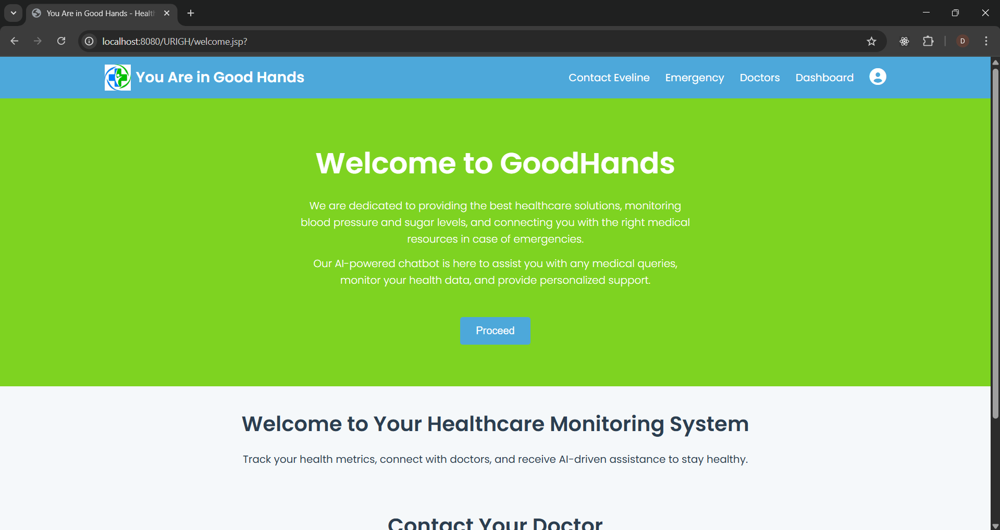
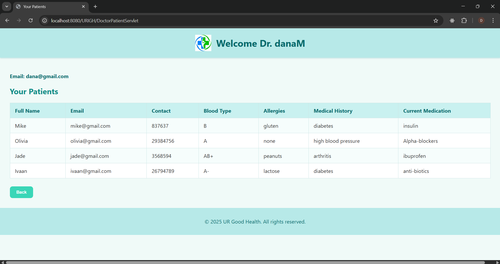
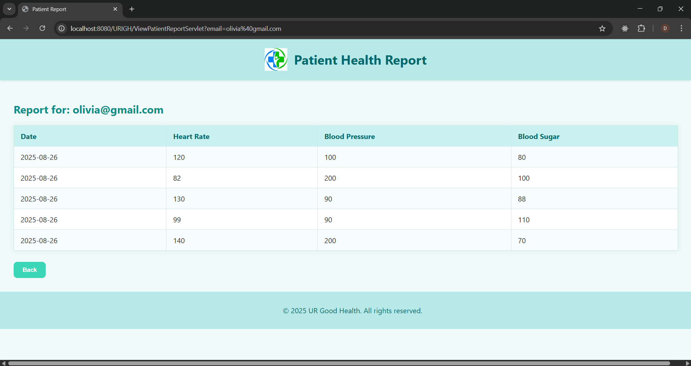
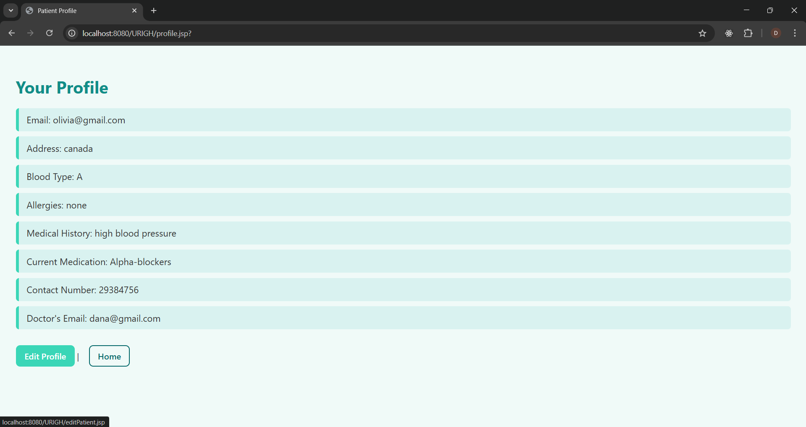

# URIGH Healthcare System

## Description
URIGH is a **full-stack healthcare management system** built with **Java Servlets, JSP, and JDBC**.  
It allows doctors and patients to register, login, manage profiles, and track health metrics.  

> The frontend is minimal, mostly JSP forms, but this project demonstrates **full-stack integration** and solid **backend skills**.  

This project showcases:
- Backend development with Servlets and JDBC
- Session management and role-based access control
- CRUD operations on a MySQL database
- Connecting frontend forms to backend services

---

## Features:

### Doctor
- Register and login
- View and manage assigned patients
- Access individual patient health reports

### Patient
- Register and login
- Update personal profile information
- Save health metrics (blood pressure, heart rate, blood sugar)
- View personal health reports

### General
- Session-based login tracking
- Role-based access control
- Database-driven CRUD operations

---

## Screenshots:
> The frontend is functional but minimal. Screenshots give a quick understanding of the workflow.

- **Dashboard**  


- **Doctor Viewing Their Patients**  


- **Patient Health Report**  


- **Patient View/Update Profile**  


---

## Setup & Usage:

### 1. Clone the repository
```bash
git clone https://github.com/Dana-Mazen/URIGH.git
```
### 2. Database Setup
- Create a MySQL database (URIGH_DB)
- Add tables user and health_metrics as used in the project.

### 3. Configure Database Connection
!! Database credentials have been removed from the repo for security.
You must update each DAO/Servlet that connects to the database:
           Connection conn = DriverManager.getConnection(
               "jdbc:mysql://localhost:3306/URIGH_DB",
               "your_db_username",
               "your_db_password"
           );
           
### 4. Deploy to Servlet Container
- Use Apache Tomcat or any servlet container
- Place the project in the webapps folder or deploy via IDE
- Access in browser: http://localhost:8080/urigh/

## Author 

-Dana Mazen


